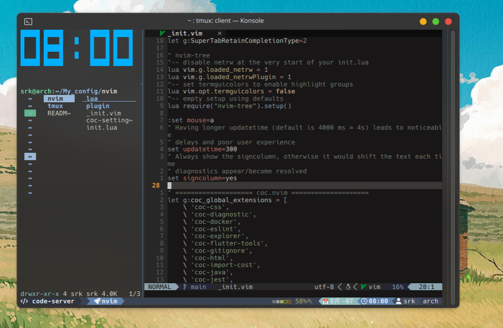
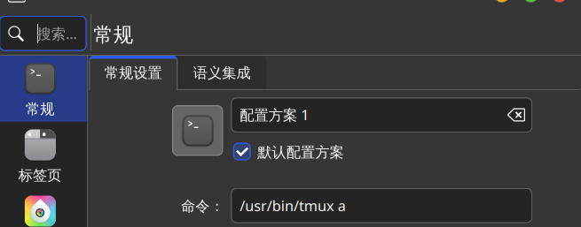

# My_config

# 预览



# 安装

```shell
yay -S tmux neovim
git clone https://github.com/Mel-SRK/My_config
cd ./My_config
cp -r ./* ~/.config
cd ~/.config/nvim
nvim ./lua/plugins.lua
:w
ln -s ~/.config/tmux/.tmux.conf ~/.tmux.conf
ln -s ~/.config/tmux/.tmux.conf.local ~/.tmux.conf.local
```

如想实现再次打开终端继续使用上次的shell,可将虚拟终端程序的启动shell改为`tmux a`(图片以kde的Konsole为例)



随后将`My_config/tmux/tmux.sh`加入开机自启(可自行搜索)

# 使用方式

## tmux

默认前置快捷键为：**Ctrl-x**

新建窗口：**Ctrl-x**+c

横向分割窗口：**Ctrl-x**+-

纵向分割窗口：**Ctrl-x**+—

默认开启鼠标支持，鼠标拖动选中文本后松开即可复制至系统剪切板

## nvim

提供了基于coc的提示自动补全及基于lsp的语法高亮渲染

使用`t`打开目录树及回到目录树`T`打开或关闭目录树
