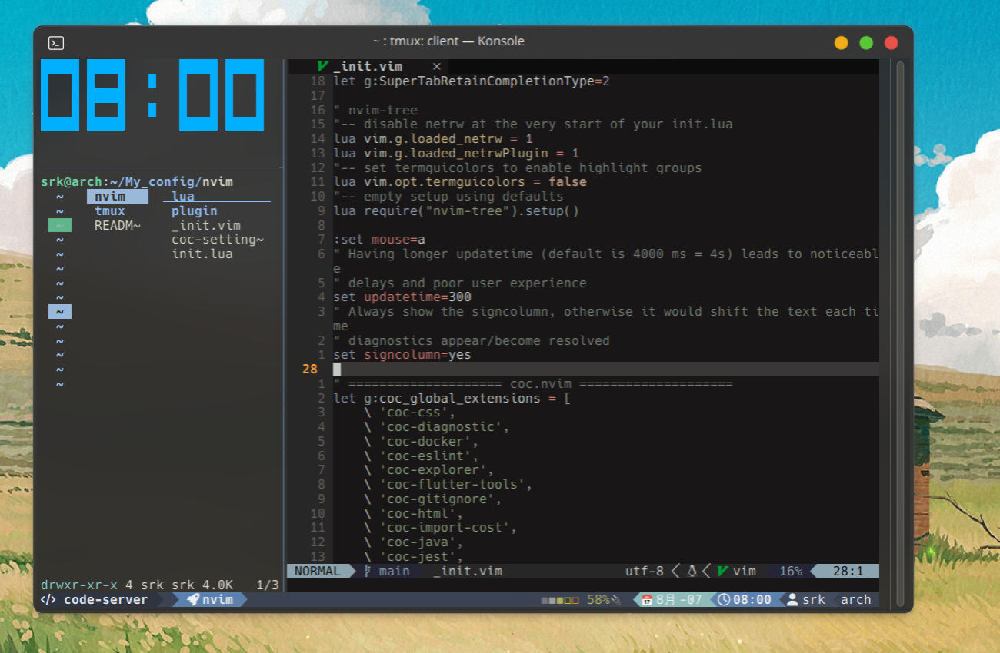
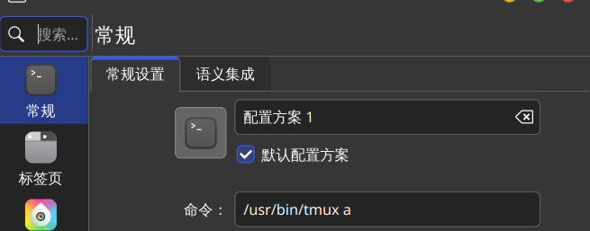

# My_config

# 预览



# 安装

```shell
yay -S tmux neovim niri alacritty fuzzel swaylock swayidle swaybg xwayland-satellite gdm noctalia-shell app2unit python-pynvim python-flake8 python-pylint python-isort tree-sitter-cli
# 非必要包(曾经使用的，现在无需理会)：mako nwg-clipman waybar
git clone https://github.com/Mel-SRK/My_config
cd ./My_config
cp -r ./* ~/.config
# lazy.nvim 会在首次启动 nvim 时自动安装，无需手动操作
# Mason LSP 服务器会在首次启动时自动下载
# 格式化工具
pip install black isort
# tmux 配置
ln -s ~/.config/tmux/.tmux.conf ~/.tmux.conf
ln -s ~/.config/tmux/.tmux.conf.local ~/.tmux.conf.local
```

如想实现再次打开终端继续使用上次的shell,可将虚拟终端程序的启动shell改为`tmux a`(图片以kde的Konsole为例)
~~建议的sddm主题:[qylock](https://github.com/darkkal44/qylock)~~

建议的sddm主题:[noctalia-sddm-theme](https://github.com/mda-dev/noctalia-sddm-theme)（与noctalia-shell风格统一，支持颜色同步和壁纸同步）



随后将`My_config/tmux/tmux.sh`加入开机自启(可自行搜索)

或者编辑`~/.bash_profile`或者`~/.zshrc`添加如下内容(推荐)

```shell
if [ -z "$TMUX" ]; then

    tmux attach -t default || tmux new -s default

fi
```

# 使用方式

## tmux

默认前置快捷键为：**Ctrl-x**

新建窗口：**Ctrl-x**+c

横向分割窗口：**Ctrl-x**+-

纵向分割窗口：**Ctrl-x**+—

默认开启鼠标支持，鼠标拖动选中文本后松开即可复制至系统剪切板

## nvim

基于 lazy.nvim + 原生 LSP + nvim-cmp 的 Python/多语言开发环境

### 基础操作

| 快捷键 | 功能 |
|---|---|
| `t` | 打开/关闭目录树 |
| `1`-`9` | 跳转到第 N 个 buffer |
| `gt` / `gT` | 下一个/上一个 buffer |
| `w` / `q` | 保存 / 退出 |
| `<C-_>` | 注释切换 |
| `<Esc>` | 清除搜索高亮 |

### 模糊搜索（fzf-lua）

| 快捷键 | 功能 |
|---|---|
| `<leader>ff` | 搜文件名 |
| `<leader>fs` | 全局搜内容 |
| `<leader>fb` | 搜已打开 buffer |
| `<leader>fh` | 最近文件 |
| `<leader>fg` | git 改动文件 |

### LSP 代码导航

| 快捷键 | 功能 |
|---|---|
| `gd` | 跳转到定义 |
| `gr` | 查找引用 |
| `K` | 悬停文档 |
| `<leader>rn` | 重命名 |
| `<leader>ca` | Code Action |
| `<leader>af` | 格式化代码 |
| `[g` / `]g` | 上一个/下一个诊断 |

### Git

| 快捷键 | 功能 |
|---|---|
| `gn` / `gp` | 下一个/上一个 hunk |
| `<leader>gb` | 行内 blame |
| `<leader>gp` | 预览 hunk |
| `<leader>gr` | 重置 hunk |

### Python

- 补全：nvim-cmp + pyright，输入时自动触发，Tab/Shift-Tab 选择，Enter 确认
- 格式化：conform.nvim 保存时自动调用 black + isort
- 诊断：仅显示 ERROR 级别，隐藏 warning/info 噪音
- 手动格式化：`<leader>af`

### 其他

- 启动仪表盘（alpha-nvim）：不带文件打开 nvim 时显示
- Markdown 预览：`<leader>mp` 在浏览器中渲染预览
- 光标词高亮（vim-illuminate）：自动标注所有相同单词
- tmux 集成：Ctrl-hjkl 无缝切换 nvim 窗口和 tmux pane

## Niri配置
Mod+T打开终端

~~Mod+B打开nwg-clipman(剪切板管理工具)~~

Mod+B打开noctalic-shell的剪切板管理工具

~~Mod+D启动fuzzel //主题配置参考https://draculatheme.com/fuzzel~~

Mod+D改为启动noctalic-shell的启动器

Ctrl+Alt+Right媒体播放下一首

Ctrl+Alt+Left媒体播放上一首

配置参考:https://kznleaf.top/2025/09/18/niri%E5%AE%89%E8%A3%85%E4%B8%8E%E9%85%8D%E7%BD%AE/;https://www.sakimidare.top/posts/niri-manual/等

## swayidle 自动锁屏配置

备份路径: `systemd/user/swayidle.service`

该文件是用户级 systemd service，用于在空闲时自动锁屏。使用 swayidle 监听空闲事件，锁屏命令为 noctalia-shell 的锁屏界面（而非 swaylock）。

恢复方式:

```shell
cp systemd/user/swayidle.service ~/.config/systemd/user/swayidle.service
systemctl --user daemon-reload
systemctl --user restart swayidle.service
```

逻辑:
- 600秒空闲 → 调用 noctalia-shell 锁屏
- 601秒 → 关闭显示器
- 睡眠前 → 调用 noctalia-shell 锁屏

## Noctalia 配置覆盖

备份路径: `noctalia/`

2026-05-30 系统优化时创建的用户覆盖文件，用于修复 bug 和降低后台资源消耗。

### 文件说明

| 备份路径 | 原始路径 | 改动说明 |
|---|---|---|
| `noctalia/settings.json` | `~/.config/noctalia/settings.json` | DDC 开启、spectrumFrameRate=20、hermes-status 新版字段、关闭桌面可视化 |
| `noctalia/plugins/privacy-indicator/Main.qml` | `~/.config/noctalia/plugins/privacy-indicator/Main.qml` | 摄像头扫描 Timer 1s→5s，降低 /proc 扫描频率 |
| `noctalia/quickshell/Modules/Bar/Widgets/ActiveWindow.qml` | `~/.config/quickshell/noctalia-shell/Modules/Bar/Widgets/ActiveWindow.qml` | 修复缺失的 user-desktop fallback icon |
| `noctalia/quickshell/Services/Networking/NetworkService.qml` | `~/.config/quickshell/noctalia-shell/Services/Networking/NetworkService.qml` | connectivity 轮询 15s→60s，事件驱动仍保留 |

### 恢复方式

```shell
# noctalia 设置
cp noctalia/settings.json ~/.config/noctalia/settings.json

# privacy-indicator 插件
cp noctalia/plugins/privacy-indicator/Main.qml ~/.config/noctalia/plugins/privacy-indicator/Main.qml

# quickshell 用户覆盖（需先有完整 overlay 目录）
cp noctalia/quickshell/Modules/Bar/Widgets/ActiveWindow.qml ~/.config/quickshell/noctalia-shell/Modules/Bar/Widgets/ActiveWindow.qml
cp noctalia/quickshell/Services/Networking/NetworkService.qml ~/.config/quickshell/noctalia-shell/Services/Networking/NetworkService.qml
systemctl --user restart niri.service
```

### 注意

- quickshell 覆盖文件需要完整的 `~/.config/quickshell/noctalia-shell/` 目录（含 shell.qml）才能生效
- 创建完整 overlay: `cp -an /etc/xdg/quickshell/noctalia-shell/. ~/.config/quickshell/noctalia-shell/`
- pacman 更新 noctalia-shell 后需重新 `cp -an` 同步新文件（`-n` 不覆盖已改文件）
- noctalia-hermes 插件（Main.qml 防重入修复）已在 ~/Git_Program/noctalia-hermes/ 仓库中，无需重复备份

## ThinkPad 麦克风静音 LED 同步

备份路径: `micmute-led/`

ThinkPad Fn+麦克风静音键按下后，内核默认的 `audio-micmute` trigger 行为不正确（LED 状态与实际麦克风静音状态不同步）。此方案用脚本监听 PipeWire source 事件，手动控制 LED 灯。

### 文件说明

| 备份路径 | 安装路径 | 说明 |
|---|---|---|
| `micmute-led/micmute-led-sync.sh` | `~/.local/bin/micmute-led-sync.sh` | 监听 pactl subscribe 事件，同步 mute 状态到 LED |
| `micmute-led/micmute-led-sync.service` | `~/.config/systemd/user/micmute-led-sync.service` | systemd 用户服务，开机自启 |
| `micmute-led/90-micmute-led.rules` | `/etc/udev/rules.d/90-micmute-led.rules` | udev 规则，给 input 组 LED 写权限 |

### 恢复方式

```shell
# udev 规则（需要 sudo）
sudo cp micmute-led/90-micmute-led.rules /etc/udev/rules.d/
sudo udevadm control --reload-rules

# 脚本 + 服务
cp micmute-led/micmute-led-sync.sh ~/.local/bin/micmute-led-sync.sh
chmod +x ~/.local/bin/micmute-led-sync.sh
cp micmute-led/micmute-led-sync.service ~/.config/systemd/user/micmute-led-sync.service
systemctl --user daemon-reload
systemctl --user enable --now micmute-led-sync.service
```

### 前提

- 用户需在 `input` 组（`sudo usermod -aG input $USER`，重新登录生效）
- udev 规则创建后首次需 `sudo chmod 660 /sys/class/leds/platform::micmute/brightness`（重启后 udev 自动应用）
- trigger 设为 `none`（脚本启动时自动设置）
