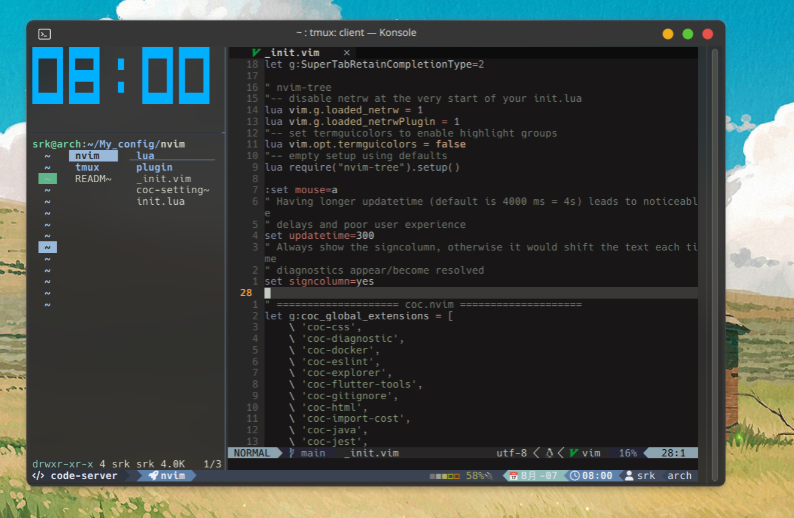
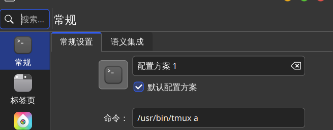

# My_config

# 预览



# 安装

```shell
sudo pacman -S tmux neovim niri alacritty fuzzel swaylock swaybg xwayland-satellite sddm noctalia app2unit python-pynvim python-flake8 python-pylint python-isort tree-sitter-cli
# 非必要包(曾经使用的，现在无需理会)：mako nwg-clipman waybar noctalia-shell noctalia-qs gdm
git clone https://github.com/Mel-SRK/My_config
cd ./My_config
cp -r ./* ~/.config
# lazy.nvim 会在首次启动 nvim 时自动安装，无需手动操作
# Mason LSP 服务器会在首次启动时自动下载
# 格式化工具
pip install black isort
# tmux 配置
ln -s ~/.config/tmux/.tmux.conf ~/.tmux.conf
ln -s ~/.config/tmux/.tmux.conf.local ~/.tmux.conf.local
```

如想实现再次打开终端继续使用上次的shell,可将虚拟终端程序的启动shell改为`tmux a`(图片以kde的Konsole为例)
~~建议的sddm主题:[qylock](https://github.com/darkkal44/qylock)~~

建议的sddm主题:[noctalia-sddm-theme](https://github.com/mda-dev/noctalia-sddm-theme)（unofficial，与 Noctalia v5 配色/壁纸同步；官方 v5 greeter 是 greetd 的 noctalia-greeter，本机仍用 SDDM）



随后将`My_config/tmux/tmux.sh`加入开机自启(可自行搜索)

或者编辑`~/.bash_profile`或者`~/.zshrc`添加如下内容(推荐)

```shell
if [ -z "$TMUX" ]; then

    tmux attach -t default || tmux new -s default

fi
```

# 使用方式

## tmux

默认前置快捷键为：**Ctrl-x**

新建窗口：**Ctrl-x**+c

横向分割窗口：**Ctrl-x**+-

纵向分割窗口：**Ctrl-x**+—

默认开启鼠标支持，鼠标拖动选中文本后松开即可复制至系统剪切板

## nvim

基于 lazy.nvim + 原生 LSP + nvim-cmp 的 Python/多语言开发环境

### 基础操作

| 快捷键 | 功能 |
|---|---|
| `t` | 打开/关闭目录树 |
| `1`-`9` | 跳转到第 N 个 buffer |
| `gt` / `gT` | 下一个/上一个 buffer |
| `w` / `q` | 保存 / 退出 |
| `<C-_>` | 注释切换 |
| `<Esc>` | 清除搜索高亮 |

### 模糊搜索（fzf-lua）

| 快捷键 | 功能 |
|---|---|
| `<leader>ff` | 搜文件名 |
| `<leader>fs` | 全局搜内容 |
| `<leader>fb` | 搜已打开 buffer |
| `<leader>fh` | 最近文件 |
| `<leader>fg` | git 改动文件 |

### LSP 代码导航

| 快捷键 | 功能 |
|---|---|
| `gd` | 跳转到定义 |
| `gr` | 查找引用 |
| `K` | 悬停文档 |
| `<leader>rn` | 重命名 |
| `<leader>ca` | Code Action |
| `<leader>af` | 格式化代码 |
| `[g` / `]g` | 上一个/下一个诊断 |

### Git

| 快捷键 | 功能 |
|---|---|
| `gn` / `gp` | 下一个/上一个 hunk |
| `<leader>gb` | 行内 blame |
| `<leader>gp` | 预览 hunk |
| `<leader>gr` | 重置 hunk |

### Python

- 补全：nvim-cmp + pyright，输入时自动触发，Tab/Shift-Tab 选择，Enter 确认
- 格式化：conform.nvim 保存时自动调用 black + isort
- 诊断：仅显示 ERROR 级别，隐藏 warning/info 噪音
- 手动格式化：`<leader>af`

### 其他

- 启动仪表盘（alpha-nvim）：不带文件打开 nvim 时显示
- Markdown 预览：`<leader>mp` 在浏览器中渲染预览
- 光标词高亮（vim-illuminate）：自动标注所有相同单词
- tmux 集成：Ctrl-hjkl 无缝切换 nvim 窗口和 tmux pane

## Niri配置
Mod+T打开终端

~~Mod+B打开nwg-clipman(剪切板管理工具)~~

Mod+B打开 Noctalia v5 剪贴板面板（`noctalia msg panel-toggle clipboard`）

~~Mod+D启动fuzzel //主题配置参考https://draculatheme.com/fuzzel~~

Mod+D打开 Noctalia v5 启动器（`noctalia msg panel-toggle launcher`）

Super+Alt+L 锁屏（`noctalia msg session lock`）

Mod+O niri overview（背景走 noctalia-backdrop 层）

Ctrl+Alt+Right / XF86AudioNext 媒体下一首

Ctrl+Alt+Left / XF86AudioPrev 媒体上一首

Fn 亮度：`noctalia msg brightness-up/down`（不再用 brightnessctl）

配置参考:https://kznleaf.top/2025/09/18/niri%E5%AE%89%E8%A3%85%E4%B8%8E%E9%85%8D%E7%BD%AE/;https://www.sakimidare.top/posts/niri-manual/等

## 外接显示器自动切换（kanshi）

当前推荐方案：`kanshi`。用于在 niri/Wayland 下根据显示器热插拔自动切换输出配置：

- 插上外接显示器 `DP-1`（HKC G27H2Max）：关闭内屏 `eDP-1`，只使用外接屏，`2560x1440@200Hz`，scale 1
- 拔掉外接显示器：恢复内屏 `eDP-1`，`2240x1400@60.002Hz`，scale 1.35

已实测：`docked -> mobile -> docked` 双向热插拔切换成功。

### 文件说明

| 备份路径 | 安装路径 | 说明 |
|---|---|---|
| `kanshi/config` | `~/.config/kanshi/config` | kanshi 输出 profile：外接屏模式关闭内屏，移动模式恢复内屏 |
| `systemd/user/kanshi.service` | `~/.config/systemd/user/kanshi.service` | kanshi 用户级 systemd 服务，随图形会话启动 |

### 恢复方式

```shell
sudo pacman -S kanshi
mkdir -p ~/.config/kanshi ~/.config/systemd/user
cp kanshi/config ~/.config/kanshi/config
cp systemd/user/kanshi.service ~/.config/systemd/user/kanshi.service
systemctl --user daemon-reload
systemctl --user enable --now kanshi.service
```

验证：

```shell
systemctl --user status kanshi.service
niri msg outputs
```

### 注意

- `mobile` profile 中必须显式写 `enable`，否则 kanshi 可能匹配 mobile 但无法重新启用被关闭过的 `eDP-1`。
- kanshi 判断的是显示器物理连接状态：DP 线仍插着时会保持外接屏模式；拔掉 DP 线才会恢复内屏。
- 旧方案 `niri-auto-edp/` 保留为 fallback/历史方案。它基于脚本监听热插拔并调用 `niri msg`，不作为当前推荐方案。除非 kanshi 在未来版本中失效，否则优先使用 kanshi。

## ~~swayidle 自动锁屏配置~~ (已废弃)

> **2026-06-23**: noctalia-shell 已原生支持空闲管理（idle timeout + lock + monitor power），
> 不再需要 swayidle + idle-action.sh 的手动链路。
> 以下文件保留在仓库中仅供历史参考，不再部署。
>
> - `systemd/user/swayidle.service` — 已废弃
> - `local/bin/idle-action.sh` — 已废弃
>
> 新方案：在 noctalia-shell 设置中直接配置空闲超时和锁屏行为。

## Noctalia v5（当前）

2026-09-06 从 AUR `noctalia-shell` + `noctalia-qs`（Quickshell / `qs -c noctalia-shell`）切到 extra 仓库的 `noctalia`（C++ 重写，二进制 `/usr/bin/noctalia`）。**没有官方 JSON→TOML 迁移**，v4 设置当历史保留，不部署。

启动：niri `spawn-at-startup "noctalia"`。IPC 一律 `noctalia msg ...`，旧命令 `qs -c noctalia-shell ipc call ...` 已失效。

### 文件说明

| 备份路径 | 原始路径 | 说明 |
|---|---|---|
| `niri/config.kdl` | `~/.config/niri/config.kdl` | v5 启动、快捷键、overview layer-rule `^noctalia-backdrop` |
| `niri/noctalia.kdl` | `~/.config/niri/noctalia.kdl` | niri 边框/焦点色（当前 GitHub Dark） |
| `noctalia/config.toml` | `~/.config/noctalia/config.toml` | 声明式：backdrop、SDDM user template、wallpaper hook |
| `noctalia/settings.toml` | `~/.local/state/noctalia/settings.toml` | GUI/运行时状态，**优先级高于 config.toml** |
| `local/bin/sddm-sync-wallpaper.sh` | `~/.local/bin/sddm-sync-wallpaper.sh` | v5 `wallpaper_changed` hook，拷当前壁纸到 SDDM 主题 |

v4 历史（不要部署到 v5）：`noctalia/settings.json`、`noctalia/plugins/`、`noctalia/quickshell/`。

### 恢复方式

```shell
sudo pacman -S noctalia
# 若仍装着 AUR 旧包：sudo pacman -Rns noctalia-shell noctalia-qs
mkdir -p ~/.config/noctalia ~/.local/state/noctalia ~/.local/bin
cp niri/config.kdl ~/.config/niri/config.kdl
cp niri/noctalia.kdl ~/.config/niri/noctalia.kdl
cp noctalia/config.toml ~/.config/noctalia/config.toml
cp noctalia/settings.toml ~/.local/state/noctalia/settings.toml
cp local/bin/sddm-sync-wallpaper.sh ~/.local/bin/sddm-sync-wallpaper.sh
chmod +x ~/.local/bin/sddm-sync-wallpaper.sh
# 然后注销或 `niri msg action load-config-file`，确认 `pgrep -a noctalia`
```

### SDDM 配色/壁纸同步（仍用 unofficial 主题，不换 greetd）

- 配色：`config.toml` 里 `[theme.templates.user.sddm]`，改配色后 `noctalia msg templates-apply`
- 壁纸：`[hooks] wallpaper_changed` 指向 `sddm-sync-wallpaper.sh`（读 `NOCTALIA_WALLPAPER_PATH`，不再读 v4 的 `~/.cache/noctalia/wallpapers.json`）
- `theme.conf` 需对用户可写（现为 `srk:srk 666`）

### 注意

- `~/.local/state/noctalia/settings.toml` 会盖掉 `config.toml`。声明式值“不生效”时先 grep 这份 state。
- overview 壁纸要 **backdrop.enabled=true（config 和 state 都要）** + niri `match namespace="^noctalia-backdrop"`。v4 的 `^noctalia-overview*` 在 v5 是空匹配。
- Win+B 必须是 `panel-toggle clipboard`，不是 launcher。
- v4 QML 插件和 `~/.config/noctalia/quickshell/` overlay 对 v5 无效。
- noctalia-hermes 插件（v4）在 `~/Git_Program/noctalia-hermes/`，v5 不能直接用。

## ThinkPad 麦克风静音 LED 同步

备份路径: `micmute-led/`

ThinkPad Fn+麦克风静音键按下后，内核默认的 `audio-micmute` trigger 行为不正确（LED 状态与实际麦克风静音状态不同步）。此方案用脚本监听 PipeWire source 事件，手动控制 LED 灯。

### 文件说明

| 备份路径 | 安装路径 | 说明 |
|---|---|---|
| `micmute-led/micmute-led-sync.sh` | `~/.local/bin/micmute-led-sync.sh` | 监听 pactl subscribe 事件，同步 mute 状态到 LED |
| `micmute-led/micmute-led-sync.service` | `~/.config/systemd/user/micmute-led-sync.service` | systemd 用户服务，开机自启 |
| `micmute-led/90-micmute-led.rules` | `/etc/udev/rules.d/90-micmute-led.rules` | udev 规则，通过 RUN+= 设置 LED 文件权限 |

### 恢复方式

```shell
# udev 规则（需要 sudo）
sudo cp micmute-led/90-micmute-led.rules /etc/udev/rules.d/
sudo udevadm control --reload-rules
sudo udevadm trigger --subsystem-match=leds

# 脚本 + 服务
cp micmute-led/micmute-led-sync.sh ~/.local/bin/micmute-led-sync.sh
chmod +x ~/.local/bin/micmute-led-sync.sh
cp micmute-led/micmute-led-sync.service ~/.config/systemd/user/micmute-led-sync.service
systemctl --user daemon-reload
systemctl --user enable --now micmute-led-sync.service
```

### 前提

- 用户需在 `input` 组（`sudo usermod -aG input $USER`，重新登录生效）
- trigger 设为 `none`（脚本启动时自动设置）

### 踩坑记录

- udev 的 `GROUP=`/`MODE=` 只对 `/dev/` 设备节点生效，对 `/sys/` 下的 sysfs 属性文件（如 brightness）无效，必须用 `RUN+=/usr/bin/chmod` + `RUN+=/usr/bin/chgrp` 手动设置权限
- systemd service 的 `StartLimitIntervalSec` 必须写在 `[Unit]` 段，放在 `[Service]` 段会被忽略

## GTK / Electron 暗色（Obsidian / Sidra）

2026-09-08：Obsidian 与 Sidra 同时变亮，系统 portal 仍是 `color-scheme=1`。根因是 Electron 把 gsettings 的 `Adwaita-dark` 当成亮色主题；本机也没装 `gnome-themes-extra`，该名字没有对应主题目录。

### 文件说明

| 备份路径 | 原始路径 | 说明 |
|---|---|---|
| `gtk-3.0/settings.ini` | `~/.config/gtk-3.0/settings.ini` | `gtk-theme-name=Adwaita` + `gtk-application-prefer-dark-theme=true` |
| `gtk-4.0/settings.ini` | `~/.config/gtk-4.0/settings.ini` | 同上 |
| `environment.d/gtk-dark.conf` | `~/.config/environment.d/gtk-dark.conf` | `GTK_THEME=Adwaita:dark`（Electron 只认冒号写法） |

gsettings：`gtk-theme='Adwaita'`，`color-scheme='prefer-dark'`。不要设成 `Adwaita-dark`。

### 恢复方式

```shell
mkdir -p ~/.config/gtk-3.0 ~/.config/gtk-4.0 ~/.config/environment.d
cp gtk-3.0/settings.ini ~/.config/gtk-3.0/settings.ini
cp gtk-4.0/settings.ini ~/.config/gtk-4.0/settings.ini
cp environment.d/gtk-dark.conf ~/.config/environment.d/gtk-dark.conf
gsettings set org.gnome.desktop.interface gtk-theme 'Adwaita'
gsettings set org.gnome.desktop.interface color-scheme 'prefer-dark'
# environment.d 对从 niri 启动的应用要重新登录才生效
```

当前会话可先：`systemctl --user set-environment GTK_THEME=Adwaita:dark`，然后完全退出并重开 Obsidian/Sidra。
