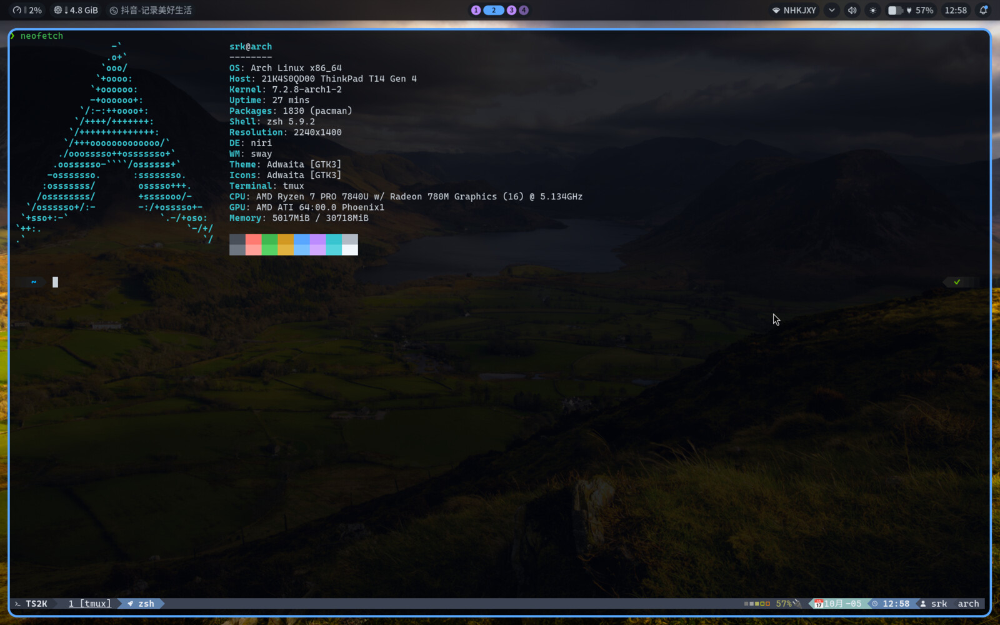

# My_config

这台 ThinkPad T14 Gen4 (AMD) 上 Arch + niri + Noctalia 的配置留档。

## 预览



仓库布局：

| 路径 | 内容 |
|---|---|
| 顶层目录（`niri/`、`alacritty/`、`noctalia/`…） | 镜像 `~/.config/` 下的同名子目录 |
| `home/` | 家目录点文件（`.zshrc`、`.gitconfig`、`.gdbinit`…） |
| `system-files/` | `/etc` 与 `/usr/local` 下手工改过的文件 |
| `archive/` | 已退役方案，只作历史留档，不要部署 |
| `tools/check-sync.sh` | 比对仓库与实机，只读 |
| `MANIFEST.tsv` | 仓库路径 ↔ 安装路径映射，安装与校验脚本都读它 |

## 当前环境

- 合成器 **niri 26.04**（滚动式列布局）；桌面 Shell **Noctalia v5**（`extra/noctalia`，二进制 `noctalia`）
- 登录器 **greetd + noctalia-greeter**（`/etc/greetd/config.toml`），`sddm` 已 disabled
- 显示：内屏 `eDP-1` 2240x1400@60.002 scale 1.35（`position x=2560`）；外接 `DP-1` HKC G27H2Max 2560x1440@200 scale 1（`position 0,0`）；热插拔切换交给 kanshi
- 终端 alacritty；shell zsh + oh-my-zsh（`/usr/share/oh-my-zsh`）+ powerlevel10k
- 输入法 fcitx5，默认 `qingjian`；X11/Java 应用走 xwayland-satellite
- 代理统一 `127.0.0.1:7897`（Clash Verge）；防火墙 firewalld（`nftables.service` 未启用）

## 键位速查

niri（`Super` 即 Mod）：

| 键 | 作用 |
|---|---|
| `Mod+T` | 终端 |
| `Alt+Space` / `Alt+D` | Noctalia 启动器 / 剪贴板面板 |
| `Super+Alt+L` | 锁屏；`Mod+O` overview |
| `Mod+H/J/K/L` | 焦点：左/下/上/右（加 `Ctrl` 变成移动） |
| `Mod+,` / `Mod+.` | 把右侧窗口并入当前列 / 把列底部窗口弹出为新列 |
| `Mod+[` / `Mod+]` | 上面两个动作的"智能版"：唯一窗口时并入相邻列，列里多窗口时把它拆出去 |
| `Mod+R` / `Mod+Shift+R` | 切换列宽 / 窗高预设；`Mod+F` maximize 列 |
| `Mod+V` 浮动、`Mod+W` 列内 tab 切换、`Mod+Q` 关窗 | |
| `Mod+Shift+E` | 重载配置（`Ctrl+Alt+Delete` 退出 niri） |

媒体键 `Ctrl+Alt+Left/Right` 或 `XF86AudioPrev/Next`，亮度走 `noctalia msg brightness-up/down`（不再用 brightnessctl）。

tmux：前缀 `Alt+n`（连按两次透传字面 `Alt+n`）。新建窗口 `Alt+n` `c`，横向分割 `-`，纵向 `|`。默认开鼠标，选中即复制到系统剪贴板。

nvim：

| 类别 | 键 |
|---|---|
| 基础 | `t` 目录树，`1`-`9` 切 buffer，`gt`/`gT` 下一个/上一个，`w`/`q` 保存/退出，`<C-_>` 注释，`<Esc>` 清搜索高亮 |
| 模糊搜索 | `<leader>ff` 文件名，`<leader>fs` 全局搜内容，`<leader>fb` buffer，`<leader>fh` 最近文件，`<leader>fg` git 改动 |
| LSP | `gd` 定义，`gr` 引用，`K` 悬停，`<leader>rn` 重命名，`<leader>ca` code action，`<leader>af` 格式化，`[g`/`]g` 诊断 |
| Git | `gn`/`gp` 上下 hunk，`<leader>gb` blame，`<leader>gp` 预览，`<leader>gr` 重置 |

补全 nvim-cmp + pyright；保存时 conform.nvim 调 black + isort；诊断只显示 ERROR。

## 装机

```shell
# 1. 装包
sudo pacman -S niri noctalia kanshi greetd xwayland-satellite alacritty tmux neovim \
               zsh fcitx5 fcitx5-chinese-addons fcitx5-qt fcitx5-gtk \
               swaybg firejail pwndbg qt6ct
# 非官方仓库：oh-my-zsh-git（提供 /usr/share/oh-my-zsh）、noctalia-greeter-git、fuck（= thefuck）
# powerlevel10k / zsh-autosuggestions / zsh-syntax-highlighting 放在 ~/.oh-my-zsh/custom/（git clone）

# 2. 取仓库并安装
git clone https://github.com/Mel-SRK/My_config && cd My_config
./install.sh            # 只打印计划
./install.sh --apply    # 真正写入（root 条目仍只打印 sudo 命令）

# 3. 收尾
systemctl --user daemon-reload
systemctl --user enable --now kanshi.service micmute-led-sync.service
ln -sf ~/.config/tmux/.tmux.conf ~/.tmux.conf
ln -sf ~/.config/tmux/.tmux.conf.local ~/.tmux.conf.local
niri msg action load-config-file
```

`install.sh` 不会碰 `archive/`。装完想确认有没有漏同步：

```shell
./tools/check-sync.sh          # 全量
./tools/check-sync.sh niri     # 只看匹配项
```

`environment.d/` 里的变量要重新登录才对 niri 启动的应用生效。

## 外接显示器（kanshi）

| profile | 触发 | 结果 |
|---|---|---|
| `docked` | 插上 DP-1 | `eDP-1` 关闭，`DP-1` 2560x1440@200 scale 1 |
| `mobile` | 拔掉 DP-1 | `eDP-1` 2240x1400@60.002 scale 1.35 |

`mobile` 里必须显式写 `enable`，否则 kanshi 匹配到了却无法重新启用被关过的 `eDP-1`。kanshi 判断的是物理连接状态：DP 线插着就保持 docked，拔线才回 mobile。

刷新率在 niri `output` 块和 kanshi profile 里各写一份，两处必须一致；不一致会看到启动后被反复切换。

## Noctalia v5

- 启动：niri `spawn-at-startup "noctalia"`；IPC 一律 `noctalia msg ...`（旧的 `qs -c noctalia-shell ipc call ...` 已失效）
- `~/.config/noctalia/config.toml`：声明式配置——backdrop、启动器/剪贴板面板里把 Tab 映射到 Up/Down
- `~/.local/state/noctalia/settings.toml`：运行时状态，**优先级高于 config.toml**。GUI 里改任何设置（换壁纸、调动画、开关组件）都会整份重写它，所以它一直在漂。改完设置同步进仓库：

  ```shell
  cp ~/.local/state/noctalia/settings.toml noctalia/settings.toml
  ```

- overview 背景要 `backdrop.enabled=true`（config 和 state 两处都要）+ niri 里 `match namespace="^noctalia-backdrop"`
- 声明式的值"不生效"时，先 grep state 那份

## 输入法

fcitx5。`fcitx5/profile` 里默认输入法是 `qingjian`，切换键 `Ctrl+Shift`，另绑 `Alt+Shift`。
环境变量在 `/etc/environment`：`QT_IM_MODULE` / `SDL_IM_MODULE` / `GLFW_IM_MODULE` / `XMODIFIERS`；`GTK_IM_MODULE` 是注释掉的——GTK 应用走原生 text-input，不需要它。

## GTK / Electron 暗色

`gtk-3.0/settings.ini` 与 `gtk-4.0/settings.ini` 用 `Adwaita` + `prefer-dark`，`environment.d/gtk-dark.conf` 再给 `GTK_THEME=Adwaita:dark`。

不要写成 `Adwaita-dark`：Electron 会把它当亮色主题，Obsidian / Sidra 就会变白（本机也没装 `gnome-themes-extra`，这个名字没有对应主题目录）。gsettings 里是 `gtk-theme='Adwaita'`、`color-scheme='prefer-dark'`。

## system-files（/etc 与 /usr/local）

只收手工改过、重装系统不会自动生成的东西：

- `/etc/greetd/config.toml` — greeter 命令与会话用户（`vt=1`、`noctalia-greeter-session`）
- `/etc/environment` — 输入法环境变量
- `/etc/pacman.conf` — multilib、blackarch（清华镜像 + `SigLevel Optional TrustAll`）、archlinuxcn
- `/etc/pam.d/greetd` — 末尾追加的 `pam_gnupg` 段（登录时把密码预置给 session 阶段，供 gpg-agent 自动解锁）
- `/etc/systemd/system/clash-verge-service.service`、`/etc/systemd/system/kvm-nat-bypass-routes.service` + `/usr/local/sbin/kvm-nat-bypass-routes.sh`（后者用 `ip rule` 8800/8900 让 `192.168.122.0/24` 的 VM 流量绕开 mihomo TUN）
- `/etc/udev/rules.d/50-nuphy.rules`、`50-vgn-mouse.rules`、`90-micmute-led.rules`

**故意没收**：`/etc/fstab`、`/etc/kernel/cmdline`、`/etc/mkinitcpio.d/linux.preset`、`/etc/mkinitcpio.conf`、`/etc/locale.conf`、`/etc/vconsole.conf` —— 装系统时生成，而且夹带 UUID / PARTUUID 这类本机指纹，备份它们对恢复没有价值（换盘就变），需要时重装时重写即可。`/etc/nftables.conf` 也没收：本机 `nftables.service` 是 disabled + inactive，实际生效的是 firewalld。

## 麦克风静音 LED

ThinkPad Fn+麦克风键默认的 `audio-micmute` trigger 状态不同步，这里用脚本盯 PipeWire 事件手动控 LED：`micmute-led/micmute-led-sync.sh`（装到 `~/.local/bin/`）+ user 服务 + udev 规则。

前提：用户在 `input` 组。踩过的两个坑：

- udev 的 `GROUP=` / `MODE=` 只对 `/dev/` 节点生效，`/sys` 下的 sysfs 属性（LED 的 brightness）必须用 `RUN+=/usr/bin/chmod` + `RUN+=/usr/bin/chgrp`
- systemd 的 `StartLimitIntervalSec` 必须写在 `[Unit]` 段，写在 `[Service]` 会被忽略

## Java / X11 应用

`environment.d/java-awt.conf` 给 `_JAVA_AWT_WM_NONREPARENTING=1`（niri 这种非重父化合成器下防 Swing 窗口空白），`environment.d/xwayland-satellite.conf` 给 `DISPLAY=:0`，让 HMCL 这类还依赖 X11 的程序找到 xwayland-satellite。

## CTF 样本沙箱（ctfdbg / ctfrun）

跑来路不明的二进制（题目附件、别人的 exp、AWD 里对手放的样本）等于把家目录、密钥、网络身份一起交出去。这两个是 firejail 包装器，默认只让样本看到它所在的当前目录。

```shell
cd ~/samples/bin/<题目>       # 必须先在样本目录里，别在 ~ 下跑
ctfdbg demo                   # 沙箱里用 pwndbg 调试（裸文件名自动补 ./）
ctfdbg demo -ex 'b *main'     # 后面的参数原样传给 gdb
ctfrun ./chall                # 直接跑样本
ctfrun python3 exp.py         # 跑 exp
ctfrun bash                   # 进沙箱内部看：mount / capsh --print / ls -a ~
ctfrun -n ./chall             # 放开网络（用你的 IP 出去）
```

| 参数 | 作用 | 代价 / 注意 |
|---|---|---|
| `--whitelist=$(pwd)` | 家目录换成空 tmpfs，只挂当前目录 | 看不到 `~/.ssh`、`~/.hermes`、`~/Documents` |
| `--net=none`（默认） | 只留 loopback，需要联网时加 `-n` | 断网 |
| `--private-tmp` / `--private-dev` | 私有 `/tmp`、精简 `/dev` | 样本写的临时文件退出即消失 |
| `--nodbus` | 不给 session dbus | 剪贴板 / 通知 / secret service 都用不了 |
| `--nosound` `--no3d` | 无音频 / 3D 设备 | — |
| `--caps.drop=all` / `--nonewprivs` / `--seccomp` | 丢能力、禁提权、拦危险 syscall | 极少数样本会被拦，属正常 |
| `--rlimit-nproc=2000` | 进程数上限 | 防 fork 炸弹拖死机器 |
| `--allow-debuggers` | 放行 ptrace | 必须开，否则 gdb 用不了 |

系统目录（`/usr` `/lib` `/etc`）仍可见但只读——动态链接的程序必须读到 libc / ld.so 才能跑，把它们也藏起来程序根本起不来。

安全性边界：和 docker 同一批内核机制（namespace + seccomp + caps），**挡不住内核 0day**；当前目录可写，别把唯一原件放进去跑；联网档下样本以你的网络身份对外发流量。

## Hermes gateway

`systemd/user/hermes-gateway.service` + `.d/proxy.conf`：从 `/opt/hermes-agent/venv` 起 gateway，转发走本机 7897 代理。单元本身没有密钥——密钥与记忆在 `~/.hermes/`，那份不进这个公开仓库。

## 没进仓库的东西

带凭据或纯个人数据，只走 `~/backups/`（手动拷 U 盘的备份集）：

`~/.config/gh/hosts.yml`（含 oauth_token）、`~/.hermes/config.yaml` 与 `auth.json`、`~/.ssh`、`~/.gnupg`、`~/.pam-gnupg`、`~/.password-store`、各应用数据目录（mozilla / QQ / discord / obsidian / chromium）、LibreOffice 的 `.docx.bak`。

## 历史与回滚

`archive/` 里是退役方案，只留文件、不再部署：waybar、fuzzel、niri-auto-edp、niri-internal-off（已由 kanshi 取代）、swayidle + `idle-action.sh`（已由 Noctalia 原生空闲管理取代）、`sddm-sync-wallpaper.sh`（SDDM 时代）、Noctalia v4 全套、以及一份与 dotfiles 无关的搜索工具说明。

2026-10-05 重写了提交历史：所有提交的作者/提交者统一为 `Mel-SRK <63025838+Mel-SRK@users.noreply.github.com>`，原先带 QQ 邮箱与真实姓名的提交哈希已全部失效。按老哈希直接访问 GitHub 仍可能取到旧对象（GitHub 不承诺即时回收），要彻底清除需走 GitHub Support。
